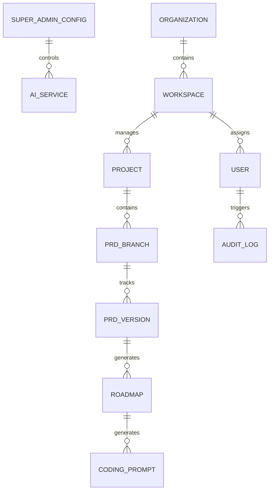

# Amvibe Enterprise — Comprehensive PRD v4

## 1. Executive Summary & Vision

Amvibe Enterprise is a visionary, AI-driven Product Planning & Orchestration workspace designed to serve as the unified source of truth for large-scale engineering teams, enterprise architects, and product organizations across all industries (Fintech, Healthcare, SaaS, Logistics, EdTech). 

Powered by advanced Large Language Models (LLMs) and custom Retrieval-Augmented Generation (RAG) architectures, Amvibe eliminates the friction of ideation. It translates raw business visions into production-ready **Product Requirements Documents (PRDs)**, actionable **Engineering Roadmaps (Next Step Planners)**, and highly optimized **Coding Prompts**. 

Amvibe is strictly separated into two domains:
1. **The User Portal (`/app`)**: A secure, multi-tenant workspace where global teams can generate documents with industry-specific compliance, collaborate in real-time, branch/merge requirements like code, and sync seamlessly with DevOps tools (Jira, GitHub).
2. **The Admin Control Center (`/admin`)**: A centralized, high-security dashboard restricted to Super Admins (specifically `raflian100@gmail.com`) to dynamically govern AI models, rotate API keys globally, monitor organizational costs, and manage user access without requiring system deployments.

All access is governed by passwordless Google Authentication, ensuring SOC2 and ISO 27001 compliance standards are met. Amvibe is not just a document editor; it is the operating system for modern product delivery.

---

## 2. Comprehensive Problem Statement

Large-scale enterprises spanning diverse industries face immense friction when aligning non-technical business stakeholders with highly technical engineering squads.

### Pain Points
1. **Siloed & Stale Documentation:** Requirements live in Confluence, tickets in Jira, and discussions in Slack. When scopes change, documentation becomes outdated immediately.
2. **Lack of Industry Standardization:** A PRD for a Healthcare app (requiring HIPAA compliance) is structurally different from a Logistics app. Generic AI tools fail to capture these nuances.
3. **Admin & Infrastructure Rigidity:** Platform administrators cannot easily switch LLM providers (e.g., from Gemini to OpenAI) during outages without pushing code updates. Managing AI costs across thousands of employees is virtually impossible.
4. **Developer Handoff Friction:** Developers waste hours translating long text documents into structural code or effective prompts for AI coding assistants (like Cursor/Copilot).

### Market Gap
No single platform securely integrates intelligent ideation, multi-industry contextual generation, Git-style version control for documents, and absolute infrastructure control for administrators into one unified enterprise ecosystem.

---

## 3. Goals

### Business Goals
- **Universal Adoption:** Become the default standard for product documentation across 100+ enterprise organizations spanning 5+ major industries.
- **Time-to-Market Acceleration:** Reduce the time from "business idea" to "first line of code" by 70%.
- **Compliance Certification:** Achieve SOC2 Type II, ISO 27001, and HIPAA compliance readiness within 12 months.

### User Goals (Product & Engineering Teams)
- Generate exhaustive PRDs, Step-by-Step Roadmaps, and Context-Aware Coding Prompts from simple language.
- Collaborate on PRDs with Git-like branching, merging, and approval workflows to safely test feature scopes.
- Sync finalized roadmaps directly into Jira Epics and Linear Tasks automatically.

### Admin Goals (Super Admin / DevOps)
- Govern platform usage via a globally restricted Control Center.
- Instantly hot-swap AI models, configure fallback models, and rotate API keys via UI.
- Monitor active sessions, total token usage, API cost analytics, and manage access via Google Auth.

---

## 4. Target Audience & Industry Verticals

Amvibe is built to be horizontally scalable and adaptable to any field via RAG contexts.

### Supported Industry Verticals
- **Fintech & Banking:** Emphasizes PCI-DSS compliance, ledger architectures, and transaction idempotency.
- **Healthcare & MedTech:** Injects HIPAA compliance, PHI (Protected Health Information) data handling, and HL7/FHIR integrations.
- **E-Commerce & Retail:** Focuses on high-throughput architectures, inventory syncing, and UX conversion flows.
- **Logistics & Supply Chain:** Prioritizes real-time tracking, geospatial DBs, and hardware integrations.
- **SaaS & EdTech:** Focuses on multi-tenancy, RBAC, subscription billing (Stripe), and user retention gamification.

### Primary Users
- **Enterprise Product Managers:** To write and maintain adaptive PRDs.
- **System Architects:** To oversee the generated roadmaps and technical stacks.
- **Software Engineers:** To extract ready-to-use coding prompts based on the PRD context.
- **Platform Super Admins:** To ensure system uptime, cost control, and security.

---

## 5. Detailed User Personas

### 1. Budi — Enterprise System Architect (User Portal)
Manages 15+ microservices squads for a top-tier Fintech.
*Needs:* Amvibe must generate roadmaps that respect their internal Kafka event-driven architecture guidelines, synced directly from their internal wiki via RAG.

### 2. Sarah — Director of Product (User Portal)
Oversees multi-region product strategy.
*Needs:* To branch a PRD into "Version B" to propose a new UI feature, discuss it with stakeholders via chat iterations, and merge it back if approved.

### 3. Raflian — Platform Super Admin (Admin Portal)
The sole infrastructure owner and platform governor.
*Needs:* A hidden dashboard to monitor the global AI token burn-rate, ban ex-employees, and switch the active AI provider instantly if the current API is rate-limited.

---

## 6. Core Product Features (By Domain)

### A. The User Portal (`/app`) — Project Orchestration
*A clean, distraction-free interface restricted to product tasks.*

1. **Multi-Industry AI Generation Engine:**
   - Users select their industry domain (Fintech, Health, etc.) before generation.
   - The AI natively formats the PRD and Roadmap with industry-specific architectural patterns and compliance constraints.
2. **Next Step Planner (Actionable Roadmapping):**
   - Automatically translates the PRD into phases (Setup, DB Design, API, Frontend).
3. **Coding Prompt Generator:**
   - Clicks on any Roadmap task to generate a rich, context-aware prompt tailored for AI IDEs.
4. **Git-Like Document Versioning (Chat-Based Iteration):**
   - Branching: Duplicate a PRD to experiment with features.
   - Iteration: Use a sticky chat bar ("Make the authentication use Magic Links instead of Passwords"). The AI modifies the document and creates a new version (`v2`).
   - Merging: Approve `v2` to become the main document source of truth.
5. **Real-time Collaboration & Comments:**
   - Multiplayer cursor presence (like Google Docs) alongside AI chat.
6. **Enterprise Integrations:**
   - **Jira / Linear:** Push roadmaps as Tickets/Epics.
   - **GitHub / GitLab:** Sync technical specs into repository Markdown files.
   - **Confluence / Notion:** Export PRDs automatically.

### B. The Admin Control Center (`/admin`) — Platform Governance
*A high-security portal accessible exclusively to the Super Admin (`raflian100@gmail.com`).*

1. **Dynamic AI Orchestration:**
   - Graphical UI to input/update API Keys for multiple providers (Google Gemini, OpenAI, Anthropic).
   - "Hot-Swap" feature to instantly change the active global model (e.g., from `gemini-1.5-pro` to `gpt-4o`) without touching environment variables or redeploying code.
2. **User & Identity Governance:**
   - Enforce Google Workspace Authentication globally.
   - Comprehensive user table with filtering: View `last_login`, `total_projects`, `status`.
   - 1-click controls to Ban, Suspend, or Delete users instantly.
3. **Cost & Token Analytics Dashboard:**
   - Visual charts showing API token consumption and estimated costs across the organization.
4. **Global System Audit Logs:**
   - Immutable tracking of who logged in, what AI models were changed, and which integrations were triggered.

---

## 7. System Architecture

```mermaid
graph TD
  Client[Web App - Next.js 15] --> Gateway[API Gateway / WAF]
  
  subgraph Frontend Routing Separation
    UserRoute[/app/* - User Workspace]
    AdminRoute[/admin/* - Admin Control Center]
  end
  
  Gateway --> Auth[Supabase Auth - Google OAuth Only]
  Gateway --> CoreAPI[Core Service - Go/NestJS]
  Gateway --> AIAPI[AI Orchestrator Service - Python/Node]
  
  CoreAPI --> DB[(Primary PostgreSQL)]
  CoreAPI --> Cache[Redis - Session/Rate Limiting]
  
  AIAPI --> ConfigDB[(Admin Config Cache)]
  AIAPI --> VectorDB[(Pinecone - RAG / Industry Contexts)]
  AIAPI --> LLM[Dynamic LLM Router: Gemini/OpenAI]
  
  CoreAPI --> EventBus[Kafka Event Bus]
  EventBus --> IntegrationWorker[Jira/GitHub Sync Worker]
  EventBus --> AuditWorker[Audit Log Worker]
```

---

## 8. Data Model & Entity Relationships



### Key Database Tables

**1. `users` (Identity via Google Auth)**
| Column | Type | Constraints | Description |
|---|---|---|---|
| id | UUID | PK | User identifier |
| email | VARCHAR | UNIQUE | Must match Google Account |
| is_admin | BOOLEAN | DEFAULT FALSE | Hardcoded `TRUE` for raflian100@gmail.com |
| status | VARCHAR | | 'ACTIVE', 'SUSPENDED', 'BANNED' |

**2. `system_configs` (Managed via Admin Portal)**
| Column | Type | Constraints | Description |
|---|---|---|---|
| key | VARCHAR | PK | e.g., 'ACTIVE_LLM', 'GEMINI_API_KEY' |
| value | TEXT | | Encrypted API keys or model names |
| updated_by | UUID | FK -> users | Admin who last changed it |

**3. `projects` & `prd_versions` (User Portal)**
| Column | Type | Constraints | Description |
|---|---|---|---|
| id | UUID | PK | Project identifier |
| industry_context| VARCHAR | | e.g., 'FINTECH', 'HEALTHCARE' |
| content | TEXT | | Markdown of the PRD |
| version_num | INT | | Incremental (v1, v2) via Chat revisions |

---

## 9. Security & Compliance Requirements

- **Authentication:** 100% Google OAuth 2.0 (No password storage).
- **Data Encryption:** AES-256 for database (Data at Rest), TLS 1.3 for API communications (Data in Transit).
- **API Key Security:** Admin-configured API keys are encrypted at the application layer before reaching the DB.
- **Audit Trails:** Every configuration change by the Admin and every document merge by a User is logged immutably.
- **Multi-Tenancy:** PostgreSQL Row-Level Security (RLS) ensures teams cannot access data from other workspaces.

---

## 10. API Design Specification

| Domain | Method | Endpoint | Description | Auth Level |
|---|---|---|---|---|
| **Auth** | `POST` | `/api/auth/google/callback` | Handle Google OAuth | Public |
| **Admin** | `GET` | `/api/admin/users` | List all users and activity | Super Admin (`raflian100...`) |
| **Admin** | `PATCH` | `/api/admin/users/{id}/status` | Ban/Suspend user | Super Admin |
| **Admin** | `PUT` | `/api/admin/config/llm` | Update global AI keys/models | Super Admin |
| **User** | `POST` | `/api/app/projects/generate` | Generate initial PRD/Roadmap | Any Authenticated User |
| **User** | `POST` | `/api/app/projects/{id}/revise` | Chat iteration (creates v2) | Project Member |
| **Sync** | `POST` | `/api/app/integrations/jira/sync` | Push Roadmap to Jira Epics | Project Member |

---

## 11. Delivery Milestones

### Phase 1: Foundation & Absolute Control (Month 1-2)
- Implement UI Layout separation (`/app` vs `/admin`).
- Implement Google OAuth and hardcode `raflian100@gmail.com` as Super Admin.
- Build Admin Portal: API Key management, Model switching, and User Ban functionality.
- Core Generation: Base PRD, Roadmap, and Prompts in the User Portal.

### Phase 2: Enterprise Context & Collaboration (Month 3-4)
- Industry Vertical selection (Fintech, Health, etc.) feeding into AI Context (RAG).
- Git-like Branching and Merging for PRDs.
- Sticky Chat Bar for iterative revisions resulting in new document versions.

### Phase 3: Integration Ecosystem & Analytics (Month 5-6)
- Jira, Confluence, and GitHub API integrations.
- Token Analytics & Cost monitoring charts in the Admin Portal.
- Real-time multiplayer cursor presence (WebSockets).

---

## 12. Success Metrics (KPIs)

- **System Uptime:** 99.99% (Measured via APM).
- **AI Generation Latency:** < 10 seconds for a full 5-page enterprise PRD via streaming.
- **User Engagement:** Average of 5+ chat revisions per project indicating successful iteration.
- **Admin Efficiency:** 0 code deployments required for changing LLM providers.

---

## 13. Open Architectural Questions

1. **Vector Database Choice:** Should we self-host Milvus inside our Kubernetes cluster for maximum data privacy, or use managed Pinecone for speed to market?
2. **Offline/Local LLM Support:** For highly classified defense/government enterprise clients, should Amvibe support connecting to an internal, locally hosted LLM (e.g., Llama 3 on private servers) via the Admin config panel?
