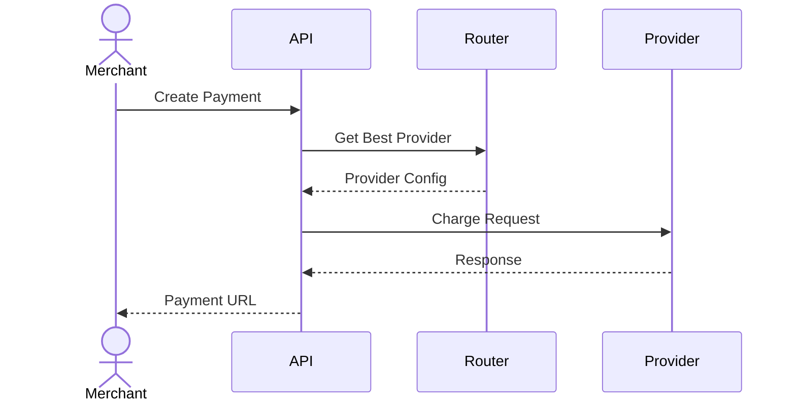
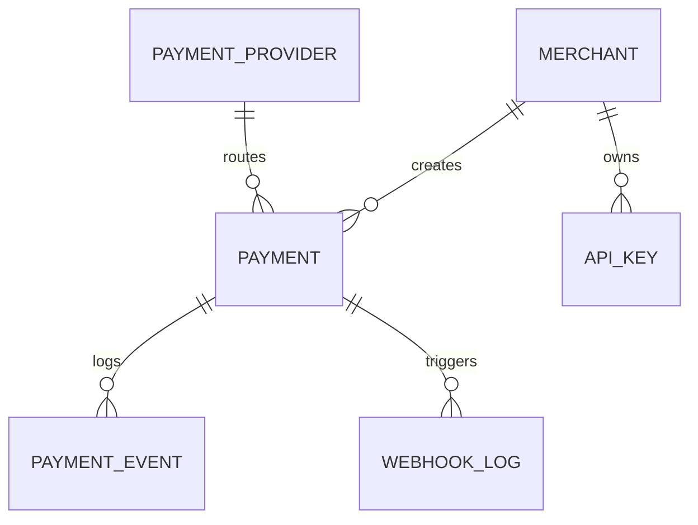

# Anything Wallet — v1

## Executive Summary

Anything Wallet is a sophisticated Payment Orchestration Platform (POP) designed to streamline transaction processing for enterprise merchants. By abstracting the complexities of multiple payment gateways—specifically Xendit, Midtrans, DOKU, and iPaymu—the platform provides a unified API interface that empowers businesses to route payments dynamically. The system focuses on increasing transaction success rates through intelligent routing rules and automated fallback mechanisms, ensuring high availability even during individual provider outages.

At its core, the platform acts as a smart middleware that evaluates incoming transactions against configurable business rules, such as payment method preference, cost-efficiency, and provider performance metrics. This capability allows merchants to optimize their operational costs and technical stability without needing to maintain individual integrations with every payment gateway. The architecture is built for extreme modularity, allowing for the rapid integration of new payment providers via a standardized adapter pattern.

Targeting high-volume e-commerce platforms and SaaS businesses, Anything Wallet solves the fragmentation problem in the Indonesian payment landscape. By centralizing reporting, webhook management, and transaction logging, we reduce the engineering overhead for our clients while providing a single source of truth for financial reconciliation. The business impact includes reduced integration maintenance, improved conversion rates through intelligent failover, and enhanced operational visibility.

## Problem Statement

Merchants currently face high operational overhead and technical debt when integrating multiple payment gateways to ensure redundancy and coverage across different payment methods.

### Pain Points

- High maintenance cost for managing multiple SDKs and API versions
- Low success rates due to single-point-of-failure in payment providers
- Difficulties in reconciling financial data across disparate provider dashboards

### Current Alternatives

Individual integration with each provider's API, manual routing logic in application code, or expensive third-party payment orchestration services.

### Market Gap

A developer-friendly, self-hosted or managed orchestration layer specifically tuned for the Indonesian payment gateway ecosystem.

## Goals

### Business Goals

- Achieve 99.99% transaction uptime via intelligent routing
- Reduce developer integration time for new payment methods by 70%
- Support 100k transactions per month in the first phase

### User Goals

- Manage all payment providers from a single dashboard
- Configure custom routing rules without code changes
- Access unified webhook logs for easier debugging

### Non-Goals

- Acting as a payment gateway itself (we are an orchestrator)
- Handling currency conversion or FX hedging
- Direct banking settlement services

## Target Audience

**Primary:** CTOs and Lead Backend Engineers at high-growth e-commerce companies.

**Secondary:** Financial Operations teams needing unified reporting.

**Market Size:** Estimated SAM in Indonesia is 500+ mid-to-large scale e-commerce businesses requiring multi-gateway redundancy.

## User Personas

### Budi Santoso — Lead Backend Engineer

Focused on system reliability and reducing technical debt.

**Goals:** Build a stable payment pipeline, Minimize maintenance effort

**Frustrations:** Dealing with inconsistent API responses from various gateways, Manual retries during outages

> "I need a single API that handles the chaos of external payment gateways so my team can focus on product features."

### Siti Aminah — Finance Operations Manager

Responsible for financial reconciliation and tracking payments.

**Goals:** Accurate transaction reporting, Fast identification of failed payments

**Frustrations:** Logging into 4 different dashboards to check status, Slow settlement reporting

> "I want to see all our revenue in one place regardless of which provider processed the payment."

### Andi Wijaya — Product Manager

Focused on conversion rates and user experience.

**Goals:** Optimize checkout flows, Increase payment success rates

**Frustrations:** High checkout drop-off rates due to gateway downtime

> "If one provider goes down, the payment should just work through another one instantly."

## User Stories

- **[Must Have]** As a Backend Engineer, I want to define a fallback provider so that if the primary gateway fails, the transaction is automatically routed to the secondary one.
  - AC: System detects 5xx error from provider
  - AC: System triggers secondary provider immediately
  - AC: Event is logged in payment_events
- **[Must Have]** As a Finance Manager, I want to see a unified dashboard of all transactions so that I don't have to check multiple portals.
  - AC: Dashboard shows status counts
  - AC: Filterable by date and provider
- **[Must Have]** As a Backend Engineer, I want to receive standardized webhooks so that my application logic remains consistent regardless of the gateway.
  - AC: All webhooks mapped to internal status
  - AC: Signature validation implemented
- **[Should Have]** As a PM, I want to configure routing rules by payment method so that I can optimize for lower transaction fees.
  - AC: Admin panel allows rule creation
  - AC: Rules are persisted in db
- **[Should Have]** As a Finance Manager, I want to export settlement reports so I can audit daily revenue.
  - AC: CSV download functionality
  - AC: Includes all processed providers
- **[Could Have]** As a Backend Engineer, I want to rotate API keys securely so that we follow security best practices.
  - AC: Keys are encrypted in database
  - AC: UI allows key rotation

## Core Features

### Provider Adapter Pattern [Must Have]

Standardized interface for all payment providers.

**User Benefit:** Extensible architecture for new gateways.

**Acceptance Criteria:**
- Interface defines mandatory methods
- All providers implement interface

**Complexity:** High | **Effort:** 3 sprints

### Dynamic Routing Engine [Must Have]

Logic to select providers based on rules.

**User Benefit:** Optimized transaction success.

**Acceptance Criteria:**
- Rules engine evaluates attributes
- Fallback logic executes on fail

**Complexity:** High | **Effort:** 4 sprints

### Webhook Orchestration [Must Have]

Centralized endpoint handling and normalization.

**User Benefit:** Unified data format for backend.

**Acceptance Criteria:**
- Signature verification works
- Events queued for processing

**Complexity:** Medium | **Effort:** 2 sprints

### Merchant Management [Must Have]

Isolated environments per merchant.

**User Benefit:** Secure multi-tenancy.

**Acceptance Criteria:**
- API keys scoped to merchants
- Access control enforced

**Complexity:** Medium | **Effort:** 2 sprints

### Transaction Dashboard [Should Have]

Real-time view of payment flow.

**User Benefit:** Instant visibility into business health.

**Acceptance Criteria:**
- Filters for date/status/provider
- Real-time updates

**Complexity:** Medium | **Effort:** 3 sprints

### Event Logging [Must Have]

Full audit trail of payment lifecycle.

**User Benefit:** Easy debugging and compliance.

**Acceptance Criteria:**
- Every state change logged
- Raw logs stored

**Complexity:** Low | **Effort:** 1 sprint

### Encrypted Credentials [Must Have]

Encryption at rest for provider keys.

**User Benefit:** Enhanced security.

**Acceptance Criteria:**
- AES-256 encryption used
- No keys in logs

**Complexity:** Low | **Effort:** 1 sprint

### Refund API [Could Have]

Unified interface for reversals.

**User Benefit:** Standardized refund handling.

**Acceptance Criteria:**
- Refunds trigger provider API
- Status updated in DB

**Complexity:** Medium | **Effort:** 2 sprints

## User Flows

### Payment Creation Flow

1. 1: Merchant calls POST /payments
2. 2: System identifies best provider via Routing Engine
3. 3: System calls provider API
4. 4: System records attempt
5. 5: Return provider redirect URL to merchant

**Happy Path:** Provider returns success, payment marked as processing.

**Edge Cases:** Provider timeout; Invalid API credentials; Routing rule conflict

### Webhook Processing Flow

1. 1: Provider sends POST to /webhooks/{provider}
2. 2: System validates signature
3. 3: System updates internal payment status
4. 4: System triggers merchant callback

**Happy Path:** Payment status updated, merchant notified.

**Edge Cases:** Signature mismatch; Duplicate webhook; Malformed payload

## System Architecture

```mermaid
graph TD
  Client[Merchant Web App] --> API[Load Balancer]
  API --> Web[Next.js Dashboard]
  API --> Gateway[Laravel API]
  Gateway --> Queue[Redis Queue]
  Queue --> Worker[Webhook Processor]
  Gateway --> DB[(PostgreSQL)]
  Gateway --> Providers[External Gateways (Xendit/Midtrans)]
```

## User Journey



## Non-Functional Requirements

### Security

- OAuth 2.0 / OIDC authentication
- Data encryption at rest using Laravel Encryption
- OWASP Top 10 compliance

### Compliance

- GDPR compliance
- PCI-DSS readiness

### Performance

- Page load < 2s on 3G
- API response < 500ms p95

### Reliability

- 99.9% uptime SLA
- Automated failover

### Scalability

- Support 10k concurrent users at launch
- Horizontal scaling via Kubernetes

### Accessibility

- WCAG 2.1 AA compliance
- Screen reader support

## Tech Stack

**Frontend:** Next.js — Fast rendering, SEO optimized, great developer experience.

**Backend:** Laravel — Robust ecosystem, excellent queue management, built-in security features.

**Database:** PostgreSQL — Reliability and complex query support for financial transactions.

**Infrastructure:** AWS — Global scale, RDS for DB, SQS for queues.

**Architecture:** Modular Monolith

### Third-Party Services

- **Redis:** Caching and Queue Driver

## Data Model

### Entity Relationship Diagram



### merchants

Client entities using the platform.

| Key | Column | Type | Constraints |
|---|---|---|---|
| 🔑 | id | `UUID` | PRIMARY KEY |
|  | name | `VARCHAR(255)` | NOT NULL |

**Indexes:** idx_merchant_name

**Relationships:** Has many payments

### payments

Core transaction record.

| Key | Column | Type | Constraints |
|---|---|---|---|
| 🔑 | id | `UUID` | PRIMARY KEY |
|  | status | `VARCHAR(20)` | NOT NULL |
|  | amount | `DECIMAL(19,4)` | NOT NULL |

**Indexes:** idx_payment_status

**Relationships:** Belongs to merchant

### payment_providers

Configured gateway credentials.

| Key | Column | Type | Constraints |
|---|---|---|---|
| 🔑 | id | `UUID` | PRIMARY KEY |
|  | slug | `VARCHAR(50)` | UNIQUE |
|  | config | `JSONB` | NOT NULL |

**Relationships:** Used by payments

### payment_events

Detailed audit log of state changes.

| Key | Column | Type | Constraints |
|---|---|---|---|
| 🔑 | id | `UUID` | PRIMARY KEY |
| 🔗 | payment_id | `UUID` | FOREIGN KEY |
|  | event | `VARCHAR(100)` | NOT NULL |

**Indexes:** idx_payment_id

**Relationships:** Belongs to payment

### webhook_logs

Raw logs for debugging.

| Key | Column | Type | Constraints |
|---|---|---|---|
| 🔑 | id | `UUID` | PRIMARY KEY |
|  | payload | `TEXT` | NOT NULL |
|  | provider | `VARCHAR(50)` | NOT NULL |

**Relationships:** Belongs to payment

## API Design

| Method | Endpoint | Description | Auth |
|---|---|---|---|
| `POST` | `/api/v1/payments` | Create a new payment. | Bearer Token (API Key) |
| `GET` | `/api/v1/payments/{id}` | Check status. | Bearer Token (API Key) |
| `POST` | `/api/v1/webhooks/{provider}` | Receive provider callback. | None (Signature Check) |
| `GET` | `/api/v1/admin/transactions` | List all transactions. | Bearer Token (Admin) |
| `POST` | `/api/v1/admin/providers` | Configure provider. | Bearer Token (Admin) |
| `POST` | `/api/v1/payments/{id}/refund` | Request refund. | Bearer Token (API Key) |

### `POST` /api/v1/payments

Create a new payment.

**Request Params:**
- amount
- currency
- payment_method

**Response:** `{ status: 'pending', id: '...' }`

**Status Codes:** 201 Created, 401 Unauthorized

### `GET` /api/v1/payments/{id}

Check status.

**Response:** `{ status: 'paid' }`

**Status Codes:** 200 OK, 404 Not Found

### `POST` /api/v1/webhooks/{provider}

Receive provider callback.

**Response:** `{ status: 'accepted' }`

**Status Codes:** 200 OK

### `GET` /api/v1/admin/transactions

List all transactions.

**Request Params:**
- page
- limit

**Response:** `{ data: [] }`

**Status Codes:** 200 OK

### `POST` /api/v1/admin/providers

Configure provider.

**Request Params:**
- name
- credentials

**Response:** `{ id: '...' }`

**Status Codes:** 201 Created

### `POST` /api/v1/payments/{id}/refund

Request refund.

**Request Params:**
- amount

**Response:** `{ status: 'requested' }`

**Status Codes:** 202 Accepted

## Milestones

### Phase 1: MVP (8 weeks)

**Deliverables:**
- Auth, Basic Routing, Xendit/Midtrans adapters

**Success Metrics:** <5s end-to-end latency, 100% successful webhook processing

### Phase 2: Expansion (6 weeks)

**Deliverables:**
- DOKU/iPaymu support, Advanced Analytics Dashboard

**Success Metrics:** 50% reduction in manual reconciliation time

### Phase 3: Optimization (4 weeks)

**Deliverables:**
- AI-based Routing, Automated Settlement

**Success Metrics:** 10% increase in checkout success rates

## Success Metrics

**North Star:** Transaction Success Rate (TSR) across all providers.

### Primary KPIs

| Metric | Target | Measurement |
|---|---|---|
| System Uptime | 99.99% | Monitoring logs |
| Latency | <500ms | APM tracing |

### Secondary KPIs

| Metric | Target | Measurement |
|---|---|---|
| Webhook Processing Time | <2s | Queue metrics |
| API Error Rate | <0.1% | Sentry logs |

## Risks & Mitigations

| Risk | Impact | Likelihood | Mitigation |
|---|---|---|---|
| Provider API breaking changes. | High | Medium | Automated regression testing for all adapters. |
| Webhook data loss. | High | Low | Persistent queueing with retries. |
| Sensitive credential leakage. | High | Low | Encryption at rest, strict IAM policies. |
| Routing logic misconfiguration. | Medium | Medium | Dry-run mode for routing rules. |

## Open Questions

- Should we support multi-currency now or later?
- Should we implement rate limiting per merchant strictly?
